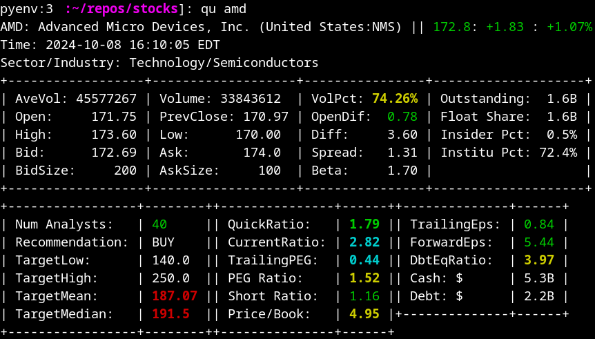

Stock Utilities
===================
The main tool is the *qu* script that gets installed to **$HOME/bin**.

.. note:: All data is extracted from the Yahoo Finance API.

Cloning the Repo
----------------------

Clone this repo into your account::

   git clone https://github.com/pcarinhas/stocks
   cd stocks

Then follow the Requirements and Installation section below.

Requirements
-------------

* You should be running Linux, and be able to open a terminal.
* You must have a version of Python installed in your personal account.
  If you don't have one you may use the included Makefile to install
  one::

     make python
     source ~/bin/pyenv.sh

You may wish to activate python when you login. In that case add this line to
your .bashrc file::

   source ~/bin/pyenv.sh

Installation
-------------

Installation should be easy::

   make install

Usage of *qu*
--------------

To use **qu**, open a terminal and type::

   source pyenv.sh  # Unless pyenv.sh is activated in ~/.bashrc as above.
   qu amd intc
